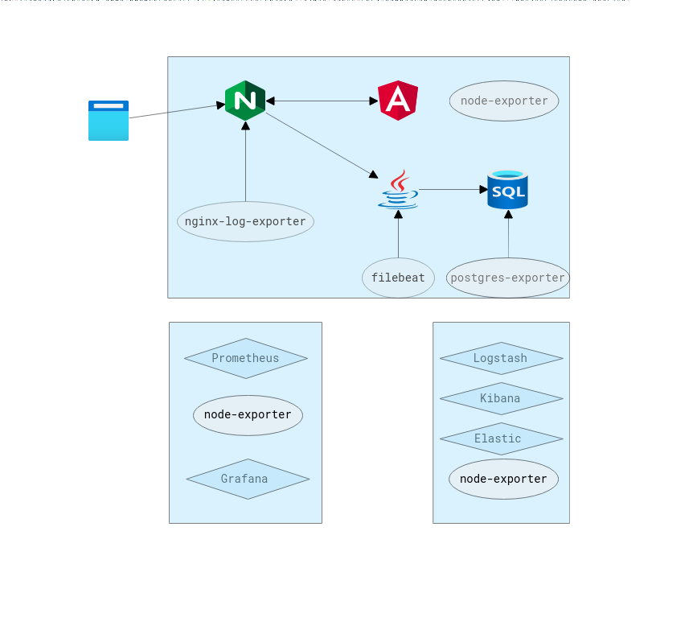

# Language application monitoring infrastructure

### Application structure
Application consists of 4 parts:
1. Frontend application. Angular.
2. Backend application. Spring.
3. Database server. PostgreSQL.
4. Reverse proxy. Nginx.

### Metrics aggregator
Prometheus is the main monitoring system. (https://github.com/prometheus/prometheus)
It takes data from different exporters:
1. Nginx log exporter
2. PostgreSQL exporter
3. Node exporter
#### Nginx log exporter
Reads nginx access logs and transforms it to different metrics\
Reference: https://github.com/martin-helmich/prometheus-nginxlog-exporter \
Example: https://blog.ruanbekker.com/blog/2020/04/25/nginx-metrics-on-prometheus-with-the-nginx-log-exporter
#### PostgreSQL exporter
Gets access to database instance and gets usage of memory, resources, databases and etc.\
Reference: https://github.com/prometheus-community/postgres_exporter
#### Node exporter
Gets general node information: cpu, disk space and etc\
Reference: https://github.com/prometheus/node_exporter
### Logs aggregator
ELK stack is used to centralize logs from the application. https://www.elastic.co/what-is/elk-stack
#### Filebeat
Filebeat is used to ship backed application logs to Logstash
Reference: https://www.elastic.co/beats/filebeat
### Metrics browser
Grafana and dashboards and alerts
Grafana is used as a monitoring and analytics solution.
https://grafana.com/

#### Dashboards
To handle data the next dashboards should be installed:
1. Prometheus Full Node Exporter https://grafana.com/grafana/dashboards/15295-prometheus-full-node-exporter
2. PostgreSQL Database https://grafana.com/grafana/dashboards/9628
3. NGINX Log Metrics https://grafana.com/grafana/dashboards/6482

#### Alerts
To receive alerts an alert manager should be configured.

---
Create new contact point.\
Alerting -> Contact points -> New Contact point -> Telegram\
Reference: https://gist.github.com/ilap/cb6d512694c3e4f2427f85e4caec8ad7

Update root notification policy\
Alerting -> Notification policies -> Set contact point\
Configure timing

Create rules\
Alerting -> Alert rules -> New alert rule

Sample: High 500 error rate.\
Query: rate(nginx_http_response_count_total{status="500"}[1m]) > 0.1
### Infrastructure

Infrastructure consists of 3 nodes:
1. Application node
2. ELK node
3. Metrics storage and analyze node

<b>Application node</b> keeps 4 elements of the system and data exporters node-exporter, nginx-log-exporter, postgres-exporter and filebeat.

<b>ELK node</b> keeps Elastic search, Logstash, Kibana and node-exporter

<b>Metrics node</b> keep Prometheus, Grafana and node-exporter

#### Metrics and logs transfer
Filebeat is configured to read system backend log file and sent logs to Logstash

Prometheus is configured to scrap metrics from each of 3 nodes node-exporters and other application node exporters

#### Deployment process

Every part of infrastructure is deployed with Ansible playbooks.\
deploy-elk.yml + hosts_logging - deploy ELK stack, node-exporter for ELK node with all prepared configs\
deploy-host-exporters.yml + hosts - deploy nginx-log-exporter, postgres-exporter, node_exporter, filebeat with all prepared configs\
deploy-metric-infrastructure.yml + hosts_metrics - deploy prometheus and node_exporter with all prepared configs

hosts files and host users variables should be updated with actual ips and users
